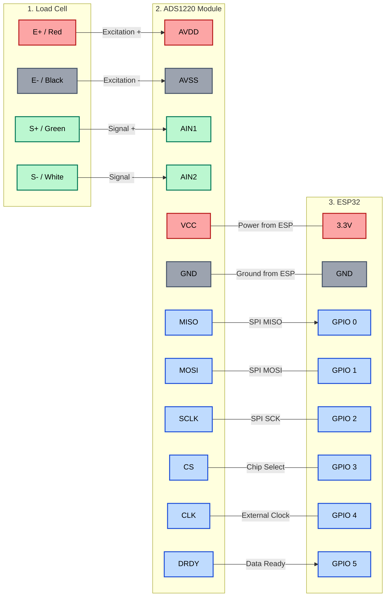

# SmartRowerPro
🚣‍♂️ Smart Rower Pro — BLE FTMS & Web App

Transform a standard rowing machine into a competitive-grade smart ergometer. This open-source project uses an ESP32 and a 24-bit ADC to acquire real-time force data from a load cell. It transmits the data via Bluetooth Low Energy (FTMS protocol) to simulators like **EXR** or **Kinomap** while hosting a built-in Web App for standalone training.

Unlike classic magnetic sensors that estimate power based on flywheel speed, this project measures the actual pulling force using a load cell (mechanically replacing the original handle). This results in extremely precise and highly responsive calculations of exerted power (Watts) and overall rowing metrics.

> **Platform support:** Windows ✅ · macOS ✅ · Linux ✅

---

## ✨ Key Features

* **Native Bluetooth FTMS:** Full compatibility with EXR, Kinomap, and standard rowing apps. No lag, maximum responsiveness.
* **1 kHz Data Acquisition:** Ultra-fast and precise force reading via the ADS1220 24-bit ADC.
* **Built-in Web App:** No third-party apps to install. The ESP32 creates its own Wi-Fi Access Point — just connect and open your browser.
* **Advanced Training Programs:** Free Style, Fixed Target, Interval Training (HIIT), Advanced Multi-Set HIIT, Custom Tabata, and Custom Pyramid.
* **Ghost Pacer & Curve Analysis:** Real-time animation of the drive/recovery phases and live plotting of the force curve.
* **Dynamic Thresholds:** Web-configurable trigger limits (in Kg) for pull initiation and handle return to perfectly match your load cell setup.
* **OTA Updates:** Flash new firmware updates directly Over-The-Air from the browser — no USB cables needed after the first flash.

---

## 🛠️ Hardware Requirements

* **Microcontroller:** ESP32-S3 (or ESP32-C3). Chosen for native BLE 5.0 support and processing power.
* **ADC:** ADS1220 module (high-precision 24-bit Analog-to-Digital Converter).
* **Sensor:** Load cell (S-Type or Ring type), mechanically installed in place of the original pulling handle.
* **Power Supply:** Standard 5V powerbank or a LiPo battery module connected to the ESP32.

### Wiring (SPI)

The ADS1220 communicates with the ESP32 via the SPI bus.

| ADS1220 Pin | ESP32 GPIO |
| :--- | :--- |
| VCC | 3.3V |
| GND | GND |
| CS | 3 |
| SCK | 2 |
| MOSI | 1 |
| MISO | 0 |
| DRDY | 5 |



---

## 🚀 Installation and Setup

### Step 1 — Install Arduino IDE

Download and install **Arduino IDE 2.x** from [arduino.cc/en/software](https://www.arduino.cc/en/software).
It runs on Windows, macOS, and Linux with no additional setup.

### Step 2 — Add the ESP32 Board Package

1. Open **File → Preferences** (Windows/Linux) or **Arduino IDE → Settings** (macOS).
2. Paste the following URL into *Additional Boards Manager URLs*:
   ```
   https://raw.githubusercontent.com/espressif/arduino-esp32/gh-pages/package_esp32_index.json
   ```
3. Open **Tools → Board → Boards Manager**, search for `esp32` by **Espressif Systems**, and click **Install**.

### Step 3 — Install the Required Libraries

Open **Tools → Manage Libraries** and install:

| Library | Author | Version |
| :--- | :--- | :--- |
| `AsyncTCP` | dvarrel | 3.3.9 |
| `ESPAsyncWebServer` | lacamera | 3.7.6 |
| `ADS1220_WE` | Wolfgang Ewald | 1.0.6 |

> The following libraries ship with the ESP32 core and require **no manual installation**:
> `WiFi` · `SPI` · `Preferences` · `ArduinoOTA` · `Update` · `BLEDevice` · `BLEServer` · `BLEUtils` · `BLE2902`

<details>
<summary>Alternative: install with <code>arduino-cli</code></summary>

If you prefer the command line, the included `sketch.yaml` lists all dependencies. Run once from the project folder:

```bash
arduino-cli lib install --config-file sketch.yaml
```

</details>

### Step 4 — Configure Board Settings

Connect the ESP32 via USB, then set the following under **Tools**:

| Setting | Value |
| :--- | :--- |
| Board | `ESP32 Dev Module` (or your specific variant) |
| Upload Speed | `921600` |
| CPU Frequency | `240MHz` |
| Flash Size | `4MB (32Mb)` |
| Partition Scheme | `Default 4MB with spiffs` |
| Port | the COM port that appears when the board is plugged in |

> **Windows tip:** if no COM port appears, install the USB-to-Serial driver for your board's chip (CP210x or CH340) from the manufacturer's website.

### Step 5 — Upload the Firmware

Open `SmartRowerPro.ino` in Arduino IDE and click **Upload** (→ arrow button).
The IDE will compile and flash the firmware. This takes about 30–60 seconds on first run.

---

## ⚙️ First Boot & Sensor Calibration

1. Power up the ESP32. It will broadcast a Wi-Fi network named **`RP_AP`** (password: `password`).
2. Connect to this network from any phone, tablet, or PC, and open a browser to:
   ```
   http://192.168.4.1
   ```
3. Go to the **SETUP & PROFILE** tab and complete the two calibration steps:

   **Step 1 — Tare (zero)**
   Make sure the load cell is at rest with zero tension on the rope, then click **SET ZERO**.

   **Step 2 — Weight calibration**
   Hang a known weight from the rope (e.g. 10 Kg), type that value in the input field, and click **CALIBRATE SENSOR**. Both values are stored in persistent flash memory and survive power cycles.

4. Enter your **Height** and **Weight** and click **SAVE PROFILE & THRESHOLDS**. These are used for the Watts / distance / calorie calculations.

---

## 🔄 OTA Firmware Updates

After the first USB flash, all future updates can be done wirelessly:

1. Export the compiled binary from **Sketch → Export Compiled Binary** (produces a `.bin` file next to the `.ino`).
2. Connect to **`RP_AP`** and navigate to `http://192.168.4.1/update`.
3. Select the `.bin` file and click **START FLASH**. The board reboots automatically when done.

---

## 📱 Using with EXR or Kinomap

The firmware gives hardware priority to the Bluetooth antenna, ensuring a stutter-free experience on professional simulators while keeping the Web App live.

1. Power on the Smart Rower Pro.
2. Open **EXR** or **Kinomap** on your PC, tablet, or Apple TV.
3. In the app, search for a new Bluetooth rowing machine — the device appears as **Smart Rower Pro**.
4. Start rowing. Real-time data (Watts, SPM, Distance, Pace) streams smoothly via BLE FTMS.

---

## 👨‍💻 Author

Developed by **Stefano Farisé**.
Exploring the intersection of industrial automation, signal processing, and DIY fitness hardware.

---

*If you find this project useful, please consider leaving a ⭐️ on the repository! Contributions, pull requests, and bug reports are always welcome.*
