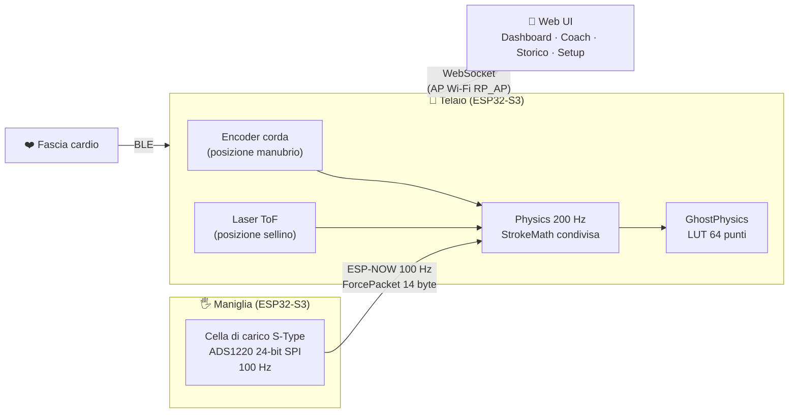

# 🚣 SmartRower Pro 2.0

**Da un vogatore ad aria economico a un ergometro strumentato con coach biomeccanico — 100% DIY, 100% offline.**


Un **V-Fit Tornado** (resistenza ad aria) trasformato in smart rower: cella di carico da 24 bit sulla maniglia, encoder sulla corda, laser ToF sul sellino, fascia cardio BLE. Due ESP32-S3 che si parlano via ESP-NOW, una web UI servita direttamente dal telaio — **niente cloud, niente abbonamenti, niente internet**: sali sul vogatore, apri il browser, voghi.

> 📊 L'analisi storica delle sessioni vive nella repo gemella **[smartrower-dashboard](https://github.com/Ste86-sudo/smartrower-dashboard)**.

---

## Indice

- [Architettura](#-architettura)
- [Il processo: da 1.0 a 2.0](#-il-processo-da-10-a-20)
- [La fisica: le ghost curves](#-la-fisica-le-ghost-curves)
- [Il coach: biomeccanica dalla letteratura](#-il-coach-biomeccanica-dalla-letteratura)
- [Scienza dell'allenamento](#-scienza-dellallenamento)
- [Struttura della repo](#-struttura-della-repo)
- [Build e flash](#-build-e-flash)
- [Provalo senza hardware](#-provalo-senza-hardware)
- [Documentazione](#-documentazione)
- [Roadmap](#-roadmap)

---

## 🏗 Architettura

Due firmware autonomi che condividono protocollo e matematica del colpo:



| Nodo | Ruolo |
|---|---|
| **Maniglia** | legge la forza a 100 Hz e la spara al telaio via ESP-NOW; se il telaio è spento diventa un rower **standalone** completo (SoftAP + web UI + OTA) |
| **Telaio** | integra forza × spostamento (lavoro reale ∫F·dx), calcola SPM/watt/pace/kcal, genera le curve ghost, serve la web UI e riceve la fascia HR via BLE |
| **Web UI** | un solo `index.html` (canvas nativo, zero CDN): dashboard live, tab Coach, storico sessioni, ghost replay — tutto in localStorage/IndexedDB del telefono |

**Tre segnali, un colpo**: la forza dice *quanto* tiri, encoder e ToF dicono *come* — la decomposizione `manubrio = gambe + tronco + braccia` (con `sellino = gambe`) è la chiave di tutta l'analisi di coordinazione.

---

## 🔄 Il processo: da 1.0 a 2.0

Questa repo racconta un refactoring completo, documentato passo passo in [docs/REVISIONE.md](docs/REVISIONE.md) e [docs/STATO.md](docs/STATO.md).

### Fase 0 — Revisione del codice 1.0
Prima di scrivere una riga: **audit sistematico** del firmware esistente. Dodici problemi individuati, tra cui:
- logica del colpo **duplicata** (e leggermente divergente) tra telaio e maniglia;
- allocazioni heap **dentro le sezioni critiche** (`String` da 2 KB costruite con gli interrupt disabilitati);
- task fisico a 1000 Hz che processava dati a 100 Hz (80% dei cicli a vuoto);
- header web UI da 280 KB duplicati e rigenerati a mano con PowerShell.

### Fase 1 — Refactoring strutturale
- **`shared/StrokeMath.h`**: un'unica implementazione di SPM, watt, pace Concept2 e kcal, usata da entrambi i firmware.
- **`GhostPhysics`**: snapshot sotto lock, formattazione JSON fuori — mai più malloc con interrupt spenti.
- **Build riproducibile**: `tools/gen_webui.py` gzippa la web UI a build time (extra_scripts PlatformIO). Un solo `web/index.html` come fonte.
- Formati wire e chiavi NVS **invariati al bit**: i firmware 2.0 sono interoperabili con l'hardware calibrato in 1.0.

### Fase 2 — Fix funzionali
OTA sulla maniglia, soglie configurabili anche in standalone, ritorno cavo istantaneo (delta encoder con segno + direzione auto-appresa), **metriche anche a encoder rotto** (stima dal picco forza, con auto-diagnosi encoder e fallback automatico).

### Fase 3 — La scienza
Qui il progetto smette di essere "un contakilometri" e diventa un **coach**: ghost curves fisiche, analisi del colpo da letteratura, W′ balance, TRIMP, storico e ghost replay. Le due sezioni seguenti spiegano come.

---

## 👻 La fisica: le ghost curves

> Specifica completa: [docs/fisica_ghost_firmware_SmartRowerPro.md](docs/fisica_ghost_firmware_SmartRowerPro.md)

La curva target ("ghost") **non è una forma disegnata a mano**: nasce da un modello fisico della macchina + un modello cinematico del corpo.

**1. La macchina.** Il Tornado è aria quasi pura, misurata sul campo:

```
F(t) = b₂·v(t)²  +  M_eff·a(t)  +  F_cord(x)
       └─ dominante ─┘  └─ ≈0 ─┘   └─ ≈0 ─┘        b₂ ≈ 110 N·s²/m²
```

**2. Il corpo.** Il drive è la sequenza gambe → tronco → braccia, ciascun segmento con profilo **minimum-jerk** (`S(p) = 10p³ − 15p⁴ + 6p⁵`), sfalsati nel tempo come in letteratura: gambe 0–60%, tronco 30–85%, braccia 55–100% del drive.

**3. La regola d'oro.** *Forma ← cinematica; ampiezza ← b₂; durata ← SPM + ritmo; watt ← output.* Si prescrive **il ritmo** (SPM + rapporto drive:recupero), non la potenza: la potenza esce dal modello con la legge del cubo `P ∝ R³/d²`.

Il firmware genera **tre ghost accoppiate** ricalcolate ad ogni cambio di ritmo (LUT 64 punti, costo trascurabile su ESP32):

| Ghost | Cosa prescrive | Cosa smaschera |
|---|---|---|
| **Forza** `F = b₂·v_h²` | quanto e con che forma | curva a spillo, picco tardivo |
| **Sellino** (gambe) | quando spingono le gambe | *shooting the slide* |
| **Braccia/tronco** | quando chiude il corpo alto | apertura busto precoce |

La forza da sola è **cieca alla coordinazione** (vede solo la somma delle velocità dei segmenti): per questo servono le tre curve insieme. Validazione: picco al 33–40% del drive, fullness 0.55–0.65 — le bande di Kleshnev.

---

## 🎯 Il coach: biomeccanica dalla letteratura

> Modello completo: [docs/super_prompt_antigravity_SmartRowerPro.md](docs/super_prompt_antigravity_SmartRowerPro.md) e [docs/antigravity_rowing_coach_prompt.md](docs/antigravity_rowing_coach_prompt.md)

Il tab **Coach** della web UI analizza ogni colpo e restituisce **un solo cue prioritario** — come farebbe un allenatore vero, che non ti urla cinque correzioni insieme. Tutto client-side in JS: zero costo firmware.

**La forma di riferimento** è la famiglia **Beta** sulla frazione di passata `u ∈ [0,1]`:

```
φ(u; p,q) = u^(p−1)·(1−u)^(q−1) / B(p,q)
```

| Preset | p | q | Picco | Fullness Φ | SPM |
|---|---|---|---|---|---|
| **Technique** | 2.0 | 3.0 | 33% | 0.56 | 18–26 |
| **Race** | 2.0 | 2.5 | 40% | 0.61 | 30–36 |

**Le feature per colpo** (con le bande di riferimento dalla letteratura — Kleshnev/Biorow, Holt et al. 2020, Warmenhoven et al. 2017-18, Dudhia):

- **Fullness Φ = F_media/F_picco** — la "pienezza" della curva: bassa = curva a spillo, connessione persa;
- **Posizione del picco** in % del drive (ideale 32–40%);
- **RFD** a regressione lineare sul fronte di salita (non due punti: a 100 Hz il rumore lo ucciderebbe);
- **Picchi secondari** — disconnessione gambe-busto-braccia;
- **RMSE di forma** vs curva Beta target;
- **Catch factor** — il sellino deve invertire 15–35 ms *prima* del manubrio (zero-crossing con interpolazione sub-campione: la risoluzione nativa di 10 ms non basta);
- **RSF** (Rowing Style Factor) — corsa sellino:manubrio nel primo 20% del drive, ottimo ~0.90: sopra 1.0 = *shooting the slide*, sotto 0.80 = apri il busto troppo presto;
- **Fatica e costanza** — deriva dell'RFD colpo su colpo, CV della passata, decoupling potenza:HR.

**Scoring a tolleranze** (`score = 100·(1 − |mis − target|/tol)`) e **cue a priorità**: prima sequenza/timing, poi carico, poi forma. Il primo gruppo sotto soglia parla, gli altri tacciono:

> *"Shooting the slide: spingi di gambe finché il manubrio non segue il sedile"*
> *"Anticipa lo sforzo: il massimo nella prima metà"*
> *"Mantieni la connessione per tutta la passata"*

---

## 🧪 Scienza dell'allenamento

Oltre alla tecnica, la dashboard integra i modelli classici della fisiologia:

| Modello | Fonte | Cosa fa |
|---|---|---|
| **W′ balance** | Skiba/Froncioni-Clarke | batteria anaerobica in tempo reale: quanto ti resta sopra la Critical Power |
| **TRIMP** | Banister | carico di allenamento della sessione |
| **Zone HR** | 5 zone sequenziali | barra tempo-in-zona live |
| **kcal** | Concept2 + Keytel (da HR) | due stime indipendenti affiancate a quella del firmware |
| **Pace** | Concept2 `W = 2.8·v³` | il pace/500 m standard degli erg |

E per il coinvolgimento: **Storico sessioni** (localStorage, trend su canvas, personal best) e **Ghost replay** — sfidi una tua sessione salvata, con il chip ±metri che ti dice se stai davanti o dietro al tuo fantasma.

---

## 📁 Struttura della repo

```
SmartRowerPro/
├── shared/                 Codice condiviso tra i due firmware
│   ├── RowerProtocol.h        Protocollo ESP-NOW (ForcePacket, CmdPacket, heartbeat)
│   ├── StrokeMath.h           Matematica del colpo — unica implementazione
│   └── StrokeEngine.h         Macchina a stati pull/release (standalone/fallback)
├── web/index.html          Web UI completa (unica fonte, gzippata a build time)
├── Telaio/                 Firmware telaio: encoder, ToF, HR BLE, web server, ESP-NOW RX
├── Maniglia/               Firmware maniglia: ADS1220, ESP-NOW TX, modalità standalone
├── tools/
│   ├── gen_webui.py           Genera l'header gzip della UI a build time
│   ├── analyzer/              Analisi post-sessione Python (stesso modello del coach + fPCA)
│   └── simulator/             Simulatore del telaio: prova la UI senza hardware
└── docs/                   Specifiche, revisione 1.0, stato lavori
```

---

## 🔨 Build e flash

Ogni firmware è un progetto PlatformIO autonomo:

```bash
cd Telaio        # oppure Maniglia
pio run                    # compila (genera anche include/WebUI_HTML.h da web/index.html)
pio run -t upload          # flash
```

- `include/WebUI_HTML.h` è **generato**: per modificare la UI si edita `web/index.html` e si ricompila.
- OTA telaio: hostname `rowing-tracker`, oppure upload del `.bin` su `http://<ip>/update`. OTA maniglia: `/update` in standalone.
- Footprint: Telaio RAM 18.8% / Flash 85.4% — Maniglia RAM 15.2% / Flash 66.8%.

### ⚠️ Vincolo: funzionamento OFFLINE

A runtime l'ESP32 è un access point isolato (`RP_AP`): il browser collegato **non ha internet**. La web UI non referenzia nessuna risorsa remota (niente CDN, niente Google Fonts): tutto embeddato inline, grafici su canvas nativo, storico in localStorage/IndexedDB.

---

## 🖥 Provalo senza hardware

```bash
cd tools/simulator
python simulate.py         # http://localhost:8080
```

Il simulatore serve la web UI **vera** e genera vogate realistiche con difetti tecnici iniettati (picco tardivo, doppio picco, shooting the slide…): vedi i cue del coach cambiare, il W′ balance scendere, le zone HR riempirsi. Con `--fault` simula anche il guasto encoder e il fallback automatico.

Per l'analisi post-sessione:

```bash
cd tools/analyzer
python analyze.py SmartRower_Export_2026-07-02.csv --height 181
```

Report con curva media vs target, trend feature, top-3 cue e **fPCA**: i *tuoi* modi di variazione del colpo, non un ideale di popolazione.

---

## 📚 Documentazione

| Documento | Contenuto |
|---|---|
| [fisica_ghost_firmware_SmartRowerPro.md](docs/fisica_ghost_firmware_SmartRowerPro.md) | La fisica delle ghost curves: modello macchina, cinematica minimum-jerk, leggi di scala con gli SPM |
| [super_prompt_antigravity_SmartRowerPro.md](docs/super_prompt_antigravity_SmartRowerPro.md) | Il super-prompt del coach: Tier A/B, modello Beta, feature, scoring, cue |
| [antigravity_rowing_coach_prompt.md](docs/antigravity_rowing_coach_prompt.md) | La specifica generale coach per ergometro strumentato (calibrazione, CSV, analizzatore) |
| [REVISIONE.md](docs/REVISIONE.md) | L'audit del codice 1.0: 12 problemi, fix, decisioni |
| [STATO.md](docs/STATO.md) | Il diario del refactoring, step per step |

Il codice 1.0 (architettura C3+S3 e dual-S3 pre-refactoring) resta consultabile nella **history git** di questa repo.

---

## 🗺 Roadmap

- [ ] Test su hardware della 2.0 (pairing, OTA maniglia, ritorno cavo, auto-diagnosi encoder, coach)
- [ ] Persistenza direzione encoder in NVS
- [ ] Canale ESP-NOW configurabile (oggi fisso sul 6)
- [ ] BLE FTMS verso EXR/Kinomap (escluso dalla 2.0, candidato futuro)
- [ ] Cue vocali
- [ ] 🌐 **Sito vetrina del progetto** (GitHub Pages): la storia, la fisica, la demo della UI

---

*Progetto DIY di [Ste86-sudo](https://github.com/Ste86-sudo). Riferimenti biomeccanici: V. Kleshnev (Biorow), Holt et al. 2020, Warmenhoven et al. 2017-18, A. Dudhia (Physics of Ergometers); fisiologia: Skiba (W′bal), Banister (TRIMP), Keytel et al. (kcal da HR).*
