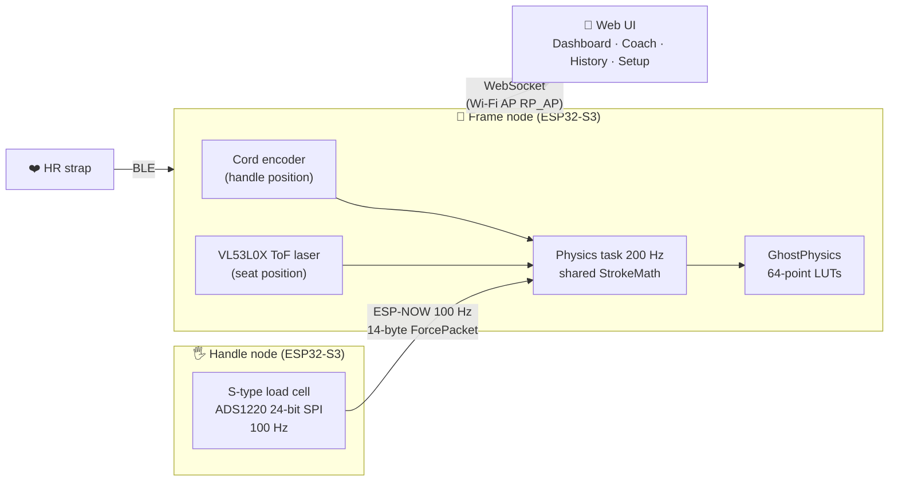

# 🚣 SmartRower Pro 2.0

**From a cheap air rower to an instrumented ergometer with a biomechanics coach — 100% DIY, 100% offline.**


A **V-Fit Tornado** (air resistance) turned into a smart rower: a 24-bit load cell on the handle, a quadrature encoder on the drive cord, a ToF laser on the seat rail, a BLE heart-rate strap. Two ESP32-S3 boards talking over ESP-NOW, a web UI served straight from the frame — **no cloud, no accounts, no internet**: sit down, open the browser, row.

> 🌐 Project site: **[smartrowerpro.com](https://smartrowerpro.com)** (live demo of the onboard app)
> 📊 Long-term analytics live in the sister repo **[smartrower-dashboard](https://github.com/Ste86-sudo/smartrower-dashboard)**.

---

## Contents

- [Architecture](#-architecture)
- [Hardware](#-hardware)
- [From 1.0 to 2.0](#-from-10-to-20)
- [The physics: ghost curves](#-the-physics-ghost-curves)
- [The coach: biomechanics from the literature](#-the-coach-biomechanics-from-the-literature)
- [Training science](#-training-science)
- [Repository layout](#-repository-layout)
- [Build & flash](#-build--flash)
- [Try it without hardware](#-try-it-without-hardware)
- [Workout library & plans](#-workout-library--plans)
- [Documentation](#-documentation)
- [Roadmap](#-roadmap)

---

## 🏗 Architecture

Two autonomous firmwares sharing the wire protocol and the stroke math:



**Three signals, one stroke**: force says *how hard*, encoder and ToF say *how*. The decomposition `handle = legs + trunk + arms` with `seat = legs` is the key to every coordination metric.

---

## 🔩 Hardware

### Donor machine

A **V-Fit Tornado** air rower: fan flywheel, cord drive, sliding seat. Measured on the machine, it behaves as almost pure air drag — `F ≈ b₂·v²` with `b₂ ≈ 110 N·s²/m²`, negligible flywheel inertia (light PU fan) and negligible return-cord force. One significant machine constant, which makes the physics model honest and cheap.

### Bill of materials

| Component | Part | Role | Notes |
|---|---|---|---|
| 2× MCU board | ESP32-S3-DevKitC-1 (4 MB flash) | handle + frame nodes | USB-CDC on boot for logs |
| Force | S-type load cell + **ADS1220** 24-bit ΔΣ ADC | handle pull force @ 100 Hz | the cell mechanically *replaces* the handle mount |
| Handle position | incremental quadrature encoder (default **600 PPR**) on the cord pulley (default Ø ≈ 31.8 mm → 100 mm circumference) | position/velocity, work = ∫F·dx | read by the ESP32 PCNT peripheral via ESP32Encoder |
| Seat position | **VL53L0X** time-of-flight laser | seat travel → leg contribution | I²C, aimed along the rail |
| Heart rate | any BLE chest strap (standard HR service 0x180D) | zones, TRIMP, W′, decoupling | NimBLE client on the frame |
| Power (handle) | LiPo + regulator on the moving handle | untethered force sensing | the handle is fully wireless |

Everything else is firmware. Total added cost is roughly the price of a mid-range HR strap.

### Pin maps

**Handle node** — the ADS1220 rides SPI as a piggyback board:

| Signal | GPIO |
|---|---|
| ADS1220 DRDY | 8 |
| SPI MISO | 9 |
| SPI MOSI | 10 |
| SPI SCK | 11 |
| ADS1220 CS | 12 |
| Standalone-mode button (INPUT_PULLUP, hold at boot) | 4 |

**Frame node:**

| Signal | GPIO |
|---|---|
| Encoder A | 4 |
| Encoder B | 5 |
| I²C SDA (VL53L0X) | 8 |
| I²C SCL (VL53L0X) | 9 |

### Why these sensors

- **24-bit ΔΣ ADC (ADS1220) instead of the usual HX711**: programmable gain and data rate, SPI with a DRDY line, and enough clean bits at 100 Hz that the firmware spends its budget on physics instead of filtering. Force is sampled at **100 Hz** — one 14-byte ESP-NOW `ForcePacket` every 10 ms.
- **Quadrature encoder on the cord pulley**: *signed* ticks give direction for free. Metres per tick = `circumference / PPR` (defaults 100 mm / 600 PPR ≈ 0.17 mm resolution); both are configurable from the Setup tab, so any pulley works. Direction is auto-learned from the first stroke; a diagnostic watchdog (valid pull > 600 ms with < 20 ticks, two strikes) switches metrics to a force-peak estimate and back, live.
- **VL53L0X ToF on the seat**: contactless, no rail modification, millimetre-ish ranging at short distance — enough for catch-factor and Rowing-Style-Factor timing, which need *when* the seat moves more than *exactly where it is*.
- **BLE strap via NimBLE**: the standard 0x180D heart-rate service, so any strap works; NimBLE keeps RAM low enough to coexist with the async web server.

### The radio link

**ESP-NOW instead of Wi-Fi/BLE between the boards**: connectionless unicast with ~ms latency and no association dance — ideal for a 100 Hz telemetry stream. Pairing is automatic on the first packet; a heartbeat detects the peer. If the frame is off, **the handle notices within 500 ms and boots as a complete standalone rower**: its own `RP_AP` access point, the same web UI, force-derived metrics, OTA at `/update`. One caveat by design: the radio channel is **fixed at 6** (`RP_CHANNEL` in `shared/RowerProtocol.h`) and must match on both boards.

### Firmware stack

| | Handle | Frame |
|---|---|---|
| Libraries | ADS1220_WE, ESPAsyncWebServer | ESPAsyncWebServer, ESP32Encoder, NimBLE-Arduino, Adafruit_VL53L0X |
| Tasks | 100 Hz sample + TX loop | 200 Hz physics task (core 1), async net task |
| Storage | NVS `rower_calib` (tare/scale) | NVS `rower` (profile, thresholds, mechanics, PBs) |
| OTA | `/update` page (standalone) | ArduinoOTA `rowing-tracker` + `/update` |

The web UI ships **inside** the firmware: `tools/gen_webui.py` gzips `web/index.html` into a C header at build time (PlatformIO `extra_scripts`), so a UI edit is just an OTA away.

---

## 🔄 From 1.0 to 2.0

The 2.0 rebuild is documented step by step in [docs/REVISIONE.md](docs/REVISIONE.md) and [docs/STATO.md](docs/STATO.md) (Italian): a systematic audit of 1.0 (duplicated stroke math, heap allocations inside critical sections, a 1 kHz task doing 100 Hz work), then a restructure around **one source of truth** — `shared/StrokeMath.h` for the stroke metrics, `web/index.html` for the UI, wire formats preserved **bit-for-bit** so existing calibrations survive the flash. Then the fun part: ghost curves, the coach, and the training-science layer.

## 👻 The physics: ghost curves

> Full spec: [docs/fisica_ghost_firmware_SmartRowerPro.md](docs/fisica_ghost_firmware_SmartRowerPro.md)

The target curve is **computed, not drawn**. Machine model: `F = b₂·v² (+ M_eff·a ≈ 0)`. Body model: each segment follows a **minimum-jerk** profile (`S(p)=10p³−15p⁴+6p⁵`), sequenced legs 0–60 %, trunk 30–85 %, arms 55–100 % of the drive. You prescribe **rhythm** (SPM + drive fraction), power is an output — cube law `P ∝ R³/d²`. The firmware keeps three coupled 64-point LUTs — force, seat, arms — because force alone is blind to coordination. Validation bands: peak at 33–40 % of the drive, fullness 0.55–0.65.

## 🎯 The coach: biomechanics from the literature

> Full spec: [docs/super_prompt_antigravity_SmartRowerPro.md](docs/super_prompt_antigravity_SmartRowerPro.md)

The Coach tab scores every stroke against a **Beta-family** target `φ(u;p,q)` (presets: *technique* p=2,q=3, peak 33 %; *race* p=2,q=2.5, peak 40 %) and reference bands from Kleshnev/Biorow, Holt et al. 2020, Warmenhoven et al. 2017-18: fullness, peak position, regression-based RFD, secondary peaks, shape RMSE, **catch factor** (sub-sample zero-crossing interpolation), **RSF** (seat:handle in the first 20 % of the drive), fatigue drift. Cues are **prioritised** — sequence, then loading, then shape — and only one speaks per stroke. All client-side JS: zero firmware cost.

## 🧪 Training science

**W′ balance** (Skiba) as a live anaerobic battery, **TRIMP** (Banister) session load, five sequential HR zones, Concept2 + Keytel calorie estimates, session history with PBs, and **ghost replay**: race the recorded wattage of a past session with a live ± metres gap.

---

## 📁 Repository layout

```
shared/          ESP-NOW protocol, StrokeMath (single implementation), StrokeEngine
web/index.html   The whole UI (single source, gzipped at build time)
Telaio/          Frame firmware   (encoder, ToF, HR BLE, web server, ESP-NOW RX)
Maniglia/        Handle firmware  (ADS1220, ESP-NOW TX, standalone mode)
tools/           gen_webui.py · analyzer/ (fPCA post-session) · simulator/ · workouts/
workouts/        153 generated workouts (.xsr/.zwo) + 4 multi-week plans
docs/            Physics & coach specs, 1.0 audit, work log
```

## 🔨 Build & flash

Each firmware is a self-contained PlatformIO project:

```bash
cd Telaio        # or Maniglia
pio run                    # builds (also regenerates include/WebUI_HTML.h from web/index.html)
pio run -t upload
```

Footprint: frame RAM 18.8 % / flash 85.4 % — handle RAM 15.2 % / flash 66.8 %.

**Offline by design**: at runtime the ESP32 is an isolated AP (`RP_AP`) — the connected browser has no internet. The UI references zero remote resources; history and athlete profile live in the phone's localStorage/IndexedDB.

## 🖥 Try it without hardware

```bash
cd tools/simulator && python simulate.py     # serves the real UI at http://localhost:8080
cd tools/analyzer  && python analyze.py SmartRower_Export.csv --height 181
```

The simulator feeds the real UI with realistic strokes and injected technique faults; the analyzer replays sessions with the coach's model plus fPCA. Or just open the live demo at [smartrowerpro.com](https://smartrowerpro.com).

## 🏋️ Workout library & plans

[`workouts/`](workouts/) contains **153 structured sessions** (EXR `.xsr` + Zwift `.zwo`) and **4 multi-week plans** ([PLANS.md](workouts/PLANS.md)), generated by [`tools/workouts/generate_workouts.py`](tools/workouts/generate_workouts.py) from the project's own models: W′-balance-engineered intervals (predicted depletion floor in each description), cube-law rate ladders, Beta-preset technique sessions, race prep.

## 📚 Documentation

| Doc | Content | Language |
|---|---|---|
| [fisica_ghost_firmware_SmartRowerPro.md](docs/fisica_ghost_firmware_SmartRowerPro.md) | Ghost-curve physics spec | IT |
| [super_prompt_antigravity_SmartRowerPro.md](docs/super_prompt_antigravity_SmartRowerPro.md) | Coach model spec (Tier A/B, scoring, cues) | IT |
| [antigravity_rowing_coach_prompt.md](docs/antigravity_rowing_coach_prompt.md) | Hardware-agnostic coach blueprint | IT |
| [REVISIONE.md](docs/REVISIONE.md) / [STATO.md](docs/STATO.md) | 1.0 audit / rebuild log | IT |

The 1.0 firmware (C3+S3 and dual-S3 pre-rebuild) remains in the git history.

## 🗺 Roadmap

- [ ] On-hardware test pass of 2.0 (pairing, handle OTA, cord return, encoder auto-diagnosis, coach)
- [ ] Persist learned encoder direction in NVS
- [ ] Configurable ESP-NOW channel (fixed at 6 today)
- [ ] BLE FTMS towards EXR/Kinomap
- [ ] Voice cues

---

*A garage build from Italy by [Ste86-sudo](https://github.com/Ste86-sudo). References: V. Kleshnev (Biorow); Holt et al. 2020; Warmenhoven et al. 2017-18; A. Dudhia, The Physics of Ergometers; Flash & Hogan 1985 (minimum jerk); Monod & Scherrer 1965 and Skiba et al. 2012 (CP/W′); Banister 1991 (TRIMP); Keytel et al. 2005. Full bibliography on [smartrowerpro.com](https://smartrowerpro.com/#refs).*
